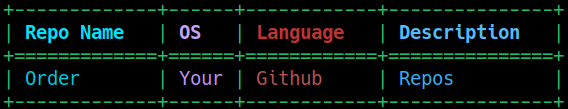

<!-- Improved compatibility of back to top link: See: https://github.com/othneildrew/Best-README-Template/pull/73 -->
<a name="readme-top"></a>
<!--
*** Thanks for checking out the Best-README-Template. If you have a suggestion
*** that would make this better, please fork the repo and create a pull request
*** or simply open an issue with the tag "enhancement".
*** Don't forget to give the project a star!
*** Thanks again! Now go create something AMAZING! :D
-->


<!-- PROJECT SHIELDS -->
<!--
*** I'm using markdown "reference style" links for readability.
*** Reference links are enclosed in brackets [ ] instead of parentheses ( ).
*** See the bottom of this document for the declaration of the reference variables
*** for contributors-url, forks-url, etc. This is an optional, concise syntax you may use.
*** https://www.markdownguide.org/basic-syntax/#reference-style-links
-->
[![Contributors][contributors-shield]][contributors-url]
[![Forks][forks-shield]][forks-url]
[![Stargazers][stars-shield]][stars-url]
[![Issues][issues-shield]][issues-url]
[![MIT License][license-shield]][license-url]
[![LinkedIn][linkedin-shield]][linkedin-url]


<!-- PROJECT LOGO -->
<br />
<div align="center">
  <a href="https://github.com/GunZF0x/OrderMyRepos">
    
  </a>

<h3 align="center">OrderMyRepos</h3>

  <p align="center">
    Tools to help you with the chaos that comes after cloning too much repositories
    <br />
    <a href="https://github.com/GunZF0x/OrderMyRepos"><strong>Explore the docs »</strong></a>
    <br />
    <br />
    <a href="https://github.com/GunZF0x/OrderMyRepos">View Demo</a>
    ·
    <a href="https://github.com/GunZF0x/OrderMyRepos/issues">Report Bug</a>
    ·
    <a href="https://github.com/GunZF0x/OrderMyRepos/issues">Request Feature</a>
  </p>
</div>


<!-- TABLE OF CONTENTS -->
<details>
  <summary>Table of Contents</summary>
  <ol>
    <li>
      <a href="#about-the-project">About The Project</a>
    </li>
    <li>
      <a href="#getting-started">Getting Started</a>
      <ul>
        <li><a href="#prerequisites">Prerequisites</a></li>
        <li><a href="#installation">Installation</a></li>
      </ul>
    </li>
    <li><a href="#usage">Usage</a></li>
     <ul>
       <li><a href="#addrepopy">addRepo.py</a></li>
       <li><a href="#showrepopy">showRepo.py</a></li>
     </ul>
    <li><a href="#license">License</a></li>
    <li><a href="#contact">Contact</a></li>
  </ol>
</details>


<!-- ABOUT THE PROJECT -->
## About The Project

[![OrderMyRepos][product-screenshot]](https://github.com/GunZF0x/OrderMyRepos)

Tools written in Python3 to help you organize your repositories Github cloned repositories

<p align="right">(<a href="#readme-top">back to top</a>)</p>


<!-- GETTING STARTED -->
## Getting Started

How many times has happened to you that you clone and clone repositories but with time you forget what they suppose to do?
So you have to revisit the site, check what it does, forget again with the time what it does and so on...

For this reason I decided to create a couple of simple features to put order in your (and mine) chaos for the repositories we use.

### Prerequisites

* Python 3.8 or higher
* `pip3` 

### Installation

1. Clone the repo
   ```sh
   git clone https://github.com/GunZF0x/OrderMyRepos.git
   ```
2. Install Python3 libraries via `pip`
   ```sh
   pip3 install beautifulsoup4
   pip3 install tabulate
   pip3 install pyperclip
   ```
   or run
   ```
   pip3 install -r requirements.txt
   ```

...and you are ready to go!

<p align="right">(<a href="#readme-top">back to top</a>)</p>


<!-- USAGE EXAMPLES -->
## Usage

### 'add' Command

Just get the url of the Github repository and add it to out "library":

```sh
python3 ordermyrepos.py add -w https://github.com/USER_HERE/REPO_HERE
```

Using this repository as an example:

```sh
python3 ordermyrepos.py add -w https://github.com/GunZF0x/OrderMyRepos
```

by default, this will create a file `repositories.txt` in the current directory the script is being run (not where the script is located) with multiple columns: 

   1. Save the original Github's weblink.
   2. Extract the title/main header of the Github's repository.
   3. Select for which Operating System (OS) is the repository scoped for (default: `Any`).
   4. Selects the (main) programming language, as indicated by Github's language bar.
   5. Extracts the description for the repository

Every time you run this script you will add a new line to your file; if the repository is already added it will throw an error.

However, I know this is a lot of stuff to our eyes if we open the file `repositories.txt` (or whatever the file you have saved your repos). For that reason I also created an additional featured called `showRepo.py`

### 'show' Command

```sh
python3 ordermyrepos.py show 
```

this will display the repositories that lies in your `repositories.txt` file in the current directory.

However, if you want to use a file that is located anywhere in your system just do:

```sh
python3 ordermyrepos.py show -f /path/to/repo/file.txt
```

For example, you can search for the word `organize` for any repository written in `Python` after ordering alphabetically by their author:
```sh
python3 ordermyrepos.py show -f examples/repositories.txt -s organize -l python --sort-by-author
```

Use
```sh
python3 ordermyrepos.py
```
or
```
python3 ordermyrepos.py -h
```
for more info.

<p align="right">(<a href="#readme-top">back to top</a>)</p>

<!-- LICENSE -->
## License

Distributed under the MIT License. See `LICENSE` for more information.

<p align="right">(<a href="#readme-top">back to top</a>)</p>


<!-- CONTACT -->
## Contact

GunZF0x  - ffcarrasco@uc.cl

Project Link: [https://github.com/GunZF0x/OrderMyRepos](https://github.com/GunZF0x/OrderMyRepos)

<p align="right">(<a href="#readme-top">back to top</a>)</p>


<!-- MARKDOWN LINKS & IMAGES -->
<!-- https://www.markdownguide.org/basic-syntax/#reference-style-links -->
[contributors-shield]: https://img.shields.io/github/contributors/GunZF0x/OrderMyRepos.svg?style=for-the-badge
[contributors-url]: https://github.com/GunZF0x/OrderMyRepos/graphs/contributors
[forks-shield]: https://img.shields.io/github/forks/GunZF0x/OrderMyRepos.svg?style=for-the-badge
[forks-url]: https://github.com/GunZF0x/OrderMyRepos/network/members
[stars-shield]: https://img.shields.io/github/stars/GunZF0x/OrderMyRepos.svg?style=for-the-badge
[stars-url]: https://github.com/GunZF0x/OrderMyRepos/stargazers
[issues-shield]: https://img.shields.io/github/issues/GunZF0x/OrderMyRepos.svg?style=for-the-badge
[issues-url]: https://github.com/GunZF0x/OrderMyRepos/issues
[license-shield]: https://img.shields.io/github/license/GunZF0x/OrderMyRepos.svg?style=for-the-badge
[license-url]: https://github.com/GunZF0x/OrderMyRepos/blob/master/LICENSE
[linkedin-shield]: https://img.shields.io/badge/-LinkedIn-black.svg?style=for-the-badge&logo=linkedin&colorB=555
[linkedin-url]: https://linkedin.com/in/francisco-carrasco-varela-cl
[product-screenshot]: images/screenshot.png
